## Interface com o usuário

### *Sprite Font*

Uma *Sprite Font* funciona como uma fonte no computador como *Times New Roman* ou *Arial*, mas as letras podem ser estilizadas e são armazenadas todas em um mesmo arquivo.

Crie um novo objeto do tipo *Sprite Font*

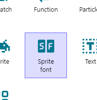

Defina como imagem o arquivo `Fonts/font30b.png` 

Não esqueça de renomear o objeto

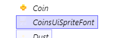

Vá nas propriedades desse objeto e deixe-as assim:

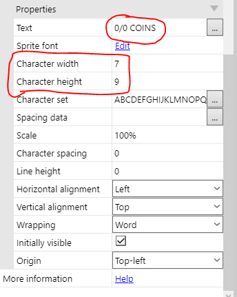

Se a configuração foi feita corretamente você conseguirá ler `0/0 COINS` no objeto, arraste-o para o topo esquerdo da tela

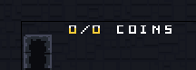

Se você executar o jogo agora perceberá que o texto aparece, mas que quando o personagem anda o texto sai da tela, para resolver isso precisamos criar uma nova camada para colocar a interface com o usuário.

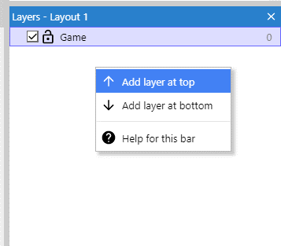

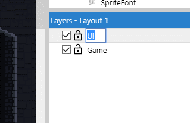

Vamos colocar o texo nessa nova camada

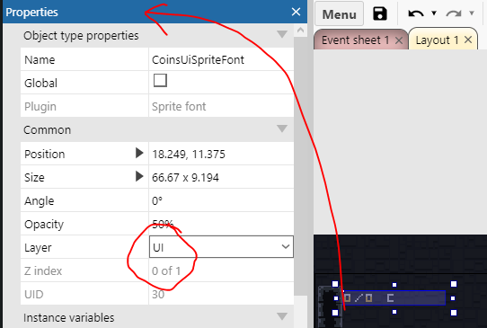

Clique no nome da interface e mude o atributo parallax para `0, 0`, isso impedirá que o texto fique "vibrando" na tela

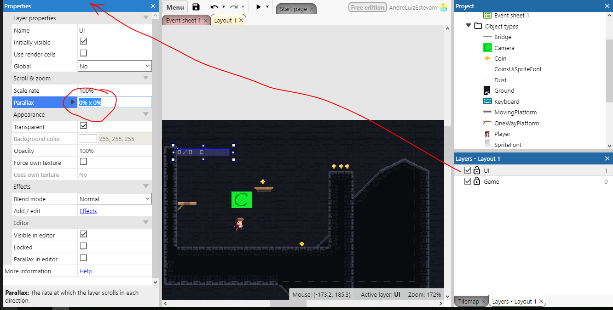

Para começar a programação precisamos criar uma variável global para guardar a quantidade total de moedas

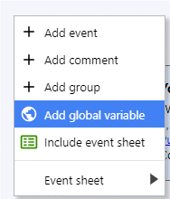

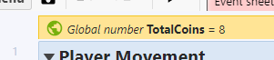

Nos blocos de eventos é esse o resultado que queremos atingir:

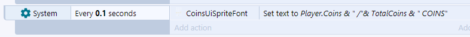

Para fazer isso precisamos escolher o objeto `System` e escolher a opção `Every x seconds` e definir como `0.1` segundos

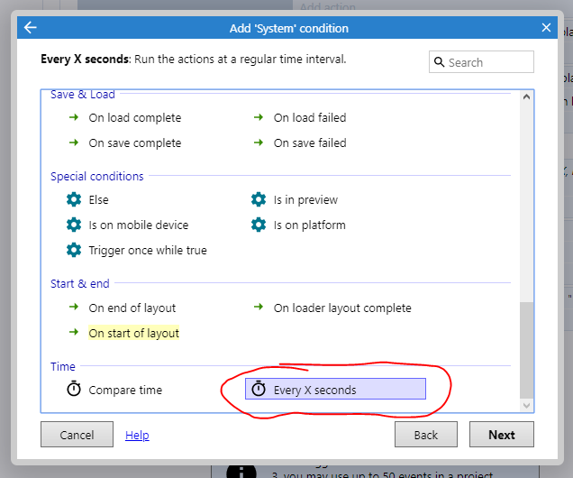

Vamos escolher nas ações o objeto `CoinSpriteFont` e usar a opção `Set text`. Vamos colocar o seguinte texto: `Player.Coins & " /"& TotalCoins & " COINS"`

Esse texto irá gerar algo do tipo `5 / 10 COINS`, representando quantas moedas o jogador pegou de um total:

`Player.Coins` estamos acessando a variável de instância que colocamos no objeto player, o programa guardará nela a quantidade de moedas que o jogador pegou.

`TotalCoins` é uma variável global, ela não está em nenhum objeto do jogo, por isso não precisamos colocar algo como `Player.TotalCoins`

Tudo que foi colocado entre aspas `"text"` é considerado um campo de texto e não comandos ou números

O operador `&` é chamado de **operador de concatenação** ele consegue **juntar** os campos de texto com os **valores numéricos** nas variáveis que referenciamos

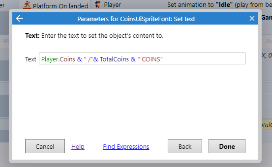

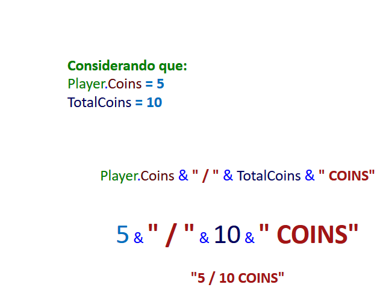