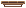

# Plataformas e Plataformas móveis

Vamos adicionar três sprites ao jogo, eles deverão receber como imagem

- `Scenario/mov1-sheet0.png` 
- `Scenario/mov5-sheet0.png`
- `Scenario/bridge-sheet0.png` 

Vamos renomeá-los da seguinte forma:

Vamos aplicar aos três o *Behavior* de `Jump Tru` que fará com que o personagem possa ficar em cima deles, mas que ao pular por baixo os atravesse.

É importante também ter as caixas de colisão feitas para que o personagem possa andar na plataforma

Obs.: aqui existe um caso especial qm que precisamos colocar a caixa de colisão um pouco abaixo da imagem, caso contrário o jogador aparecerá flutuando na base.

Agora vamos fazer com que o objeto `MovingPlatform` se torne uma plataforma que se move. Adicione o comportamento `Sine`

Configure-o da seguinte forma

Você pode alterar esses valores para ter o efeito desejado, 

- mude a direção em `Movement: Horizontal`ou `Vertical`
- Use o atributo `Period` para alterar o **período** do movimento, isto é, o tempo de cada ciclo
- Use o atributo `Magnitude` para alterar o **tamanho** do movimento

Dependendo do efeito que quiser passar você pode mudar o tipo da onda em `Wave`

- `Sine`: acelera no meio do movimento e desacelera quando vai mudar de direção
- `Triangle`: permanece com a mesma velocidade, sem desacelerar para mudar a direção
- `Square`: irá aparecer e desaparecer nas pontas de onde o movimento ocorre
- `Sawtooth` e `Reverse Sawthooth`: vai para a direita (ou esquerda), some e volta a origem

**Dica:** na hora de posicionar a plataforma que se movimenta no layout, coloque-a no **meio** da área que deve cobrir com o movimento

**Dica:** depois de ter todas as plataformas prontas você pode criar uma cópia facilmente clicando e arrastando uma plataforma pronta enquanto segura a tecla `crtl`

