# Sons

## Objeto Audio

Uma parte muito importante de um jogo é o som, no nosso jogo vamos adicionar um objeto do tipo `Audio` para poder tocar sons:

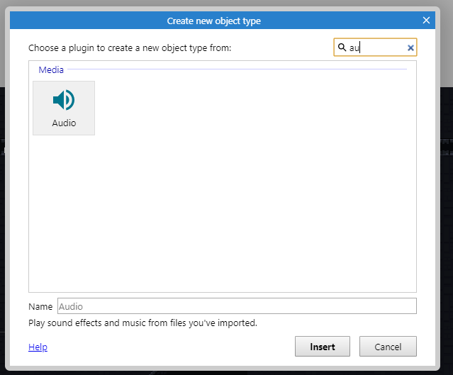

## Quais sons escolher?

Isso depende do seu jogo. Vamos listar os que foram utilizados no jogo de exemplo, para os seus sons você pode:

1. Procurar em sites que permitem o download gratuito (a seguir)
2. Gravar seus próprios sons.
   - Você pode usar um celular ou um computador para gravar sons específicos que não consiga encontrar.
   - Encontre um lugar silencioso, pense em como reproduizir o som que tem em mente, grave e edite usando as ferramentas que mostraremos a seguir.

Na hora de escolher considere que você pode:

- Tocar mais de um som ao mesmo tempo;
- Tocar sons de maneira encadeada;
- Definir vários sons para um mesmo evento e escolher um deles quando esse evento acontecer. 

**Os sons utilizados no jogo foram:**

**Músicas temas do jogo**:

<audio controls><source src="audio/cave_theme1.ogg" type="audio/ogg"/></audio>

<audio controls><source src="audio/cave_theme2.ogg" type="audio/ogg"/></audio>

**Pular** - esses dois sons tocam ao mesmo tempo quando o jogador está pulando

<audio controls><source src="audio/player_jump1.ogg" type="audio/ogg"/></audio>

<audio controls><source src="audio/player_jump2.ogg" type="audio/ogg"/></audio>

**Andar** - a cada passo do jogador um desses sons toca aleatoriamente

<audio controls><source src="audio/player_step_stone1.ogg" type="audio/ogg"/></audio>

<audio controls><source src="audio/player_step_stone2.ogg" type="audio/ogg"/></audio>

<audio controls><source src="audio/player_step_stone3.ogg" type="audio/ogg"/></audio>

<audio controls><source src="audio/player_step_stone4.ogg" type="audio/ogg"/></audio>

<audio controls><source src="audio/player_step_stone5.ogg" type="audio/ogg"/></audio>

<audio controls><source src="audio/player_step_stone6.ogg" type="audio/ogg"/></audio>

**Cair** - quando o jogador cai no chão, esse é o som tocado:

<audio controls><source src="audio/player_land.ogg" type="audio/ogg"/></audio>

**Coletar moeda** - quando uma moeda atinge o jogador esses dois sons tocam ao mesmo tempo

<audio controls><source src="audio/coin2.ogg" type="audio/ogg"/></audio>

<audio controls><source src="audio/coin.ogg" type="audio/ogg"/></audio>

**Acender tocha** - são três sons combinados: fósforo acendendo, tocha sendo acendida e fogueira:

<audio controls><source src="audio/ignition2.ogg" type="audio/ogg"/></audio>

<audio controls><source src="audio/foom_0.ogg" type="audio/ogg"/></audio>

<audio controls><source src="audio/fire_crackling.ogg" type="audio/ogg"/></audio>

**Player nascendo no checkpoint** - quando o jogador morre, esse é o som tocado assim que ele renascer:

<audio controls><source src="audio/pop.ogg" type="audio/ogg"/></audio>

**Player puxando o arco**:

<audio controls><source src="audio/arrow_shot_pulling2.ogg" type="audio/ogg"/></audio>

**Player soltando o arco**:

<audio controls><source src="audio/arrow_shot_lettingout.ogg" type="audio/ogg"/></audio>

**Impacto da flecha**:

<audio controls><source src="audio/arrow_impact2.ogg" type="audio/ogg"/></audio>

**Monstro** -  se o jogador estiver perto de um inimigo, ele começará a tocar os seguintes sons:

<audio controls><source src="audio/monster_idle1.ogg" type="audio/ogg"/></audio>

<audio controls><source src="audio/monster_idle2.ogg" type="audio/ogg"/></audio>

**Monstro sendo atingido pela flecha** - um desses sons será escolhido aleatóriamente:

<audio controls><source src="audio/monster_scream2.ogg" type="audio/ogg"/></audio>

<audio controls><source src="audio/monster_scream4.ogg" type="audio/ogg"/></audio>

<audio controls><source src="audio/monster_scream5.ogg" type="audio/ogg"/></audio>

**Monstro morrendo** - existem dois grupos de sons, um para o monstro e outro para as moedas, um som de cada grupo será escolhido:

Inimigo:

<audio controls><source src="audio/monster_die1.ogg" type="audio/ogg"/></audio>

<audio controls><source src="audio/monster_die2.ogg" type="audio/ogg"/></audio>

<audio controls><source src="audio/monster_die3.ogg" type="audio/ogg"/></audio>

Moedas:

<audio controls><source src="audio/coin_drop.ogg" type="audio/ogg"/></audio>

<audio controls><source src="audio/coin_fall.ogg" type="audio/ogg"/></audio>

<audio controls><source src="audio/coin_fall2.ogg" type="audio/ogg"/></audio>

<audio controls><source src="audio/coin_fall3.ogg" type="audio/ogg"/></audio>

**Player sendo atacado**: quando o jogador é atacado, um desses sons é escolhido e tocado

<audio controls><source src="audio/player_hit1.ogg" type="audio/ogg"/></audio>

<audio controls><source src="audio/player_hit2.ogg" type="audio/ogg"/></audio>

<audio controls><source src="audio/player_hit3.ogg" type="audio/ogg"/></audio>

<audio controls><source src="audio/player_ouch.ogg" type="audio/ogg"/></audio>

<audio controls><source src="audio/player_ouch2.ogg" type="audio/ogg"/></audio>

## Onde encontro efeitos e músicas?

Agora você precisará encontrar sons para colocar no jogo, existem vários sites que disponibilizam sons gratuitamente, mas são em inglês, você precisará traduzir o termo que quer procurar. Tente buscar sons nos sites (listados por ordem de qualidade):

- [freesound.org](https://freesound.org/)
  - Requer cadastro para baixar
  - Tem tanto efeitos comuns como sons de jogos
  - Tem músicas
- [opengameart.com](https://opengameart.org/art-search-advanced?keys=sound&title=&field_art_tags_tid_op=or&field_art_tags_tid=&name=&field_art_type_tid%5B%5D=12&field_art_type_tid%5B%5D=13&field_art_licenses_tid%5B%5D=17981&field_art_licenses_tid%5B%5D=2&field_art_licenses_tid%5B%5D=17982&field_art_licenses_tid%5B%5D=3&field_art_licenses_tid%5B%5D=6&field_art_licenses_tid%5B%5D=5&field_art_licenses_tid%5B%5D=10310&field_art_licenses_tid%5B%5D=4&field_art_licenses_tid%5B%5D=8&field_art_licenses_tid%5B%5D=7&sort_by=score&sort_order=DESC&items_per_page=24&Collection=)
  - Não requer cadastro para baixar
  - Tem apenas efeitos para jogos
  - Tem músicas
- [noiseforfun.com](http://www.noiseforfun.com/browse-sound-effects/)
  - Não requer cadastro para baixar
  - Tem apenas efeitos para jogos
- [freesfx.co.uk](http://www.freesfx.co.uk)
  - Não requer cadastro para baixar
  - Tem efeitos e músicas comuns e para jogos
- [incompetech.com](http://incompetech.com/music/)
  - Não requer cadastro para baixar
  - Tem apenas músicas
- [soundjay.com](https://www.soundjay.com)
  - Não requer cadastro para baixar
  - Tem efeitos e músicas comuns

## Melhor forma de nomear os arquivos

É recomendável que você pense em uma estrutura para o nome dos sons, por exemplo, para os seguintes sons, os seguintes nomes de arquivos são interessantes:

- Som do jogador pulando: `player_jump` ou `jogador_pulo`
- Som do jogador caindo: `player_fall` ou `jogador_caindo`
- Som do jogador andando: `player_walk` ou `jogador_andando`
- Segundo som do jogador andando: `player_walk2` ou `jogador_andando2`
- Som de espada atacando: `sword_attak` ou `espada_ataque`
- Som do inimigo gritando: `enemy_scream`  ou `inimigo_grito`
- Segundo som do inimigo gritando: `enemy_scream2`  ou `inimigo_grito2`
- Terceiro som do inimigo gritando: `enemy_scream3`  ou `inimigo_grito3`
- Som do inimigo pulando: `enemy_jump` ou `inimigo_pulo`

## Escolhendo e editando os sons

Na hora de escolher o som você deve prestar atenção em algumas coisas

1. Se o som se repetir muitas vezes no jogo, ele deve ser mais curto e mais baixo
   - Podemos controlar o volume do som dentro do construct
   - O tamanho depende da sua escolha

1. Alguns sons estão em arquivos com outros sons ou demoram muito para começar
   - Precisamos cortar esses arquivos. Uma ferramenta on-line interessante é o [audiotrimmer.com](https://audiotrimmer.com)

Veja que quando esse som começa (no começo da linha azul) não há som por um bom tempo, isso dificulta  sincronizar o efeito sonoro com o evento que o causou no jogo.

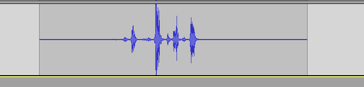

Precisamos de sons que pareçam assim:

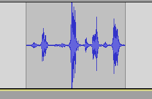

Veja que o efeito acontece logo que o som começa. Essa ação de cortar o começo e o fim de um som quando eles não contém nada é chamado de *trim* ou "aparar".

Caso seu som se pareça mais com o primeiro use o seguinte botão para importar o som.

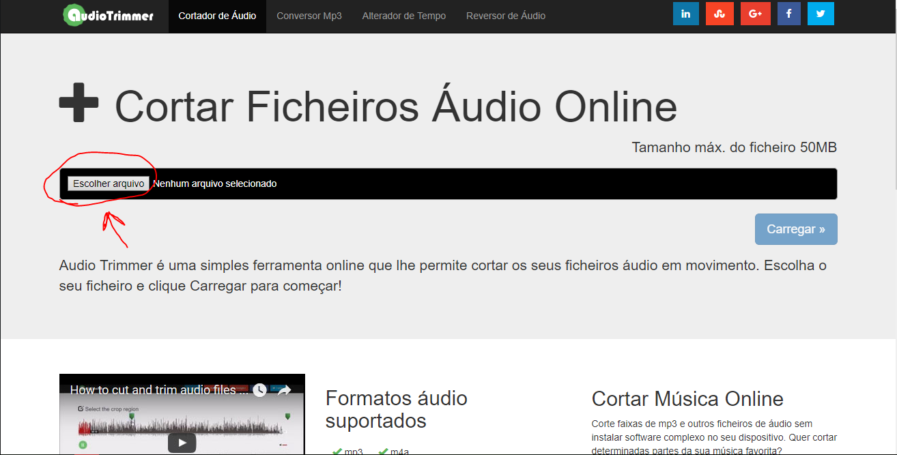

O site tentará cortar os sons automaticamente, mas você pode mover as abas para fazer o processo manualmente.

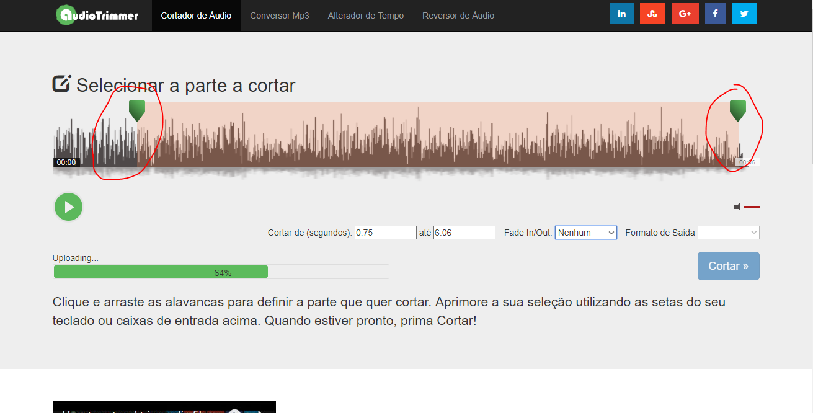

Quando tiver finalizado clique em `Cortar`

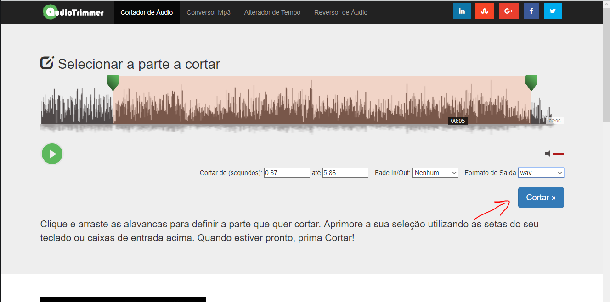

E então em `Descarregar`

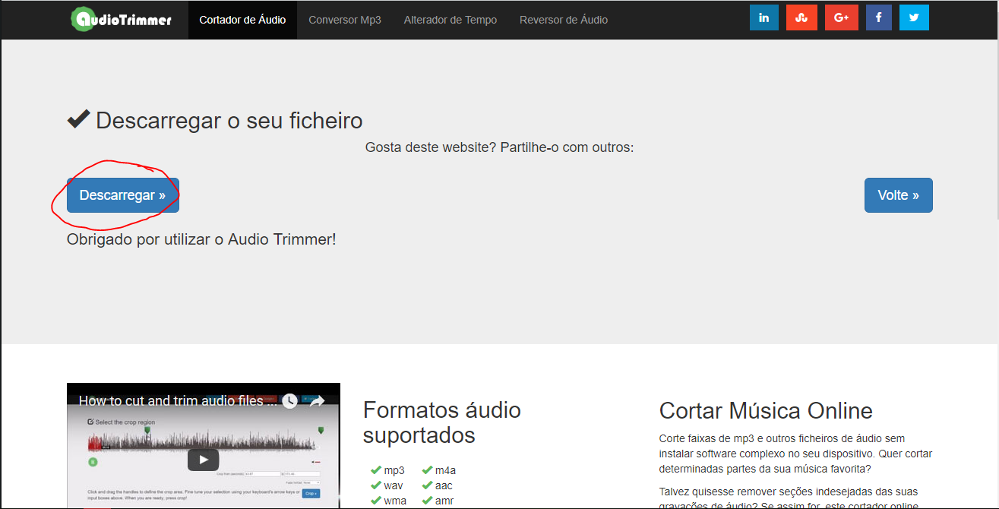

Caso precise editar os sons adicionando efeitos use o [twistedwave.com](https://twistedwave.com/online)

## Importando Sons

Usando os nomes dessa forma você conseguirá localizar os sons mais facilmente no construct

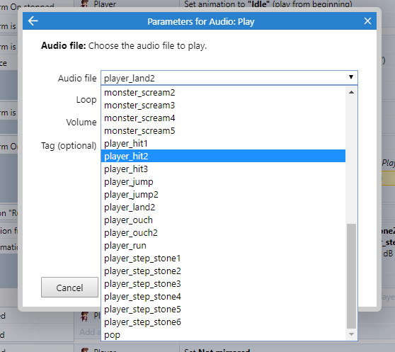

Com seus sons baixados e nomeados faça o seguinte para adicioná-los ao construct:

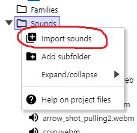

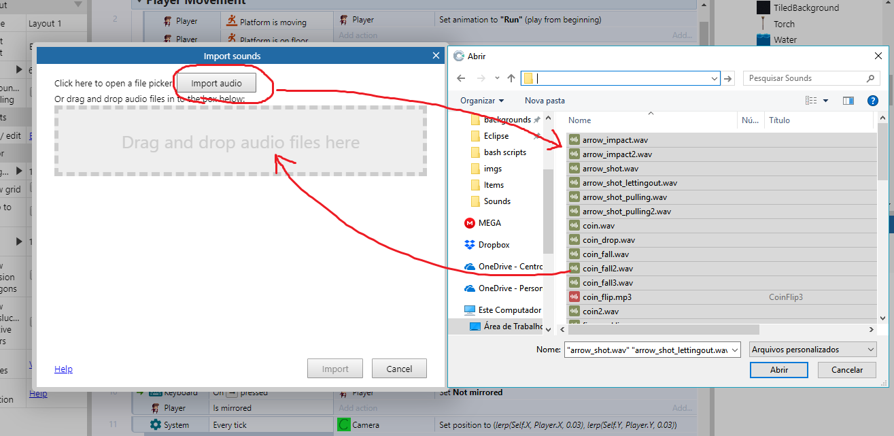

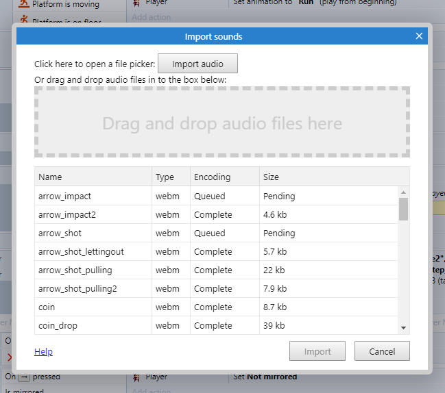

Espere os sons carregarem e o botão `Import` ser liberado, então clique nele

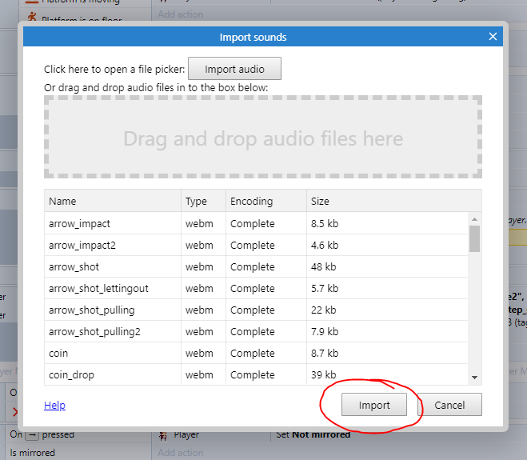

# Tocando os sons

## Quando um evento acontecer

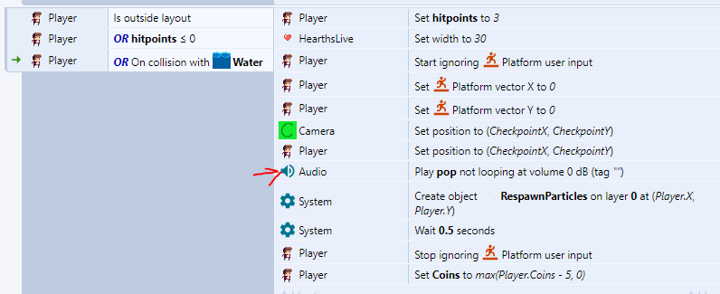

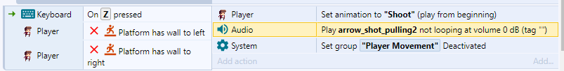

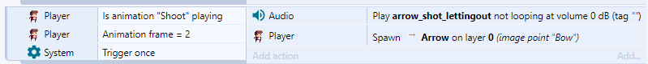

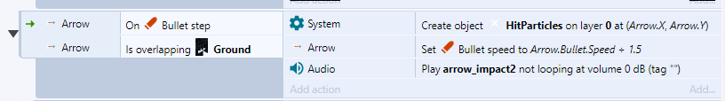

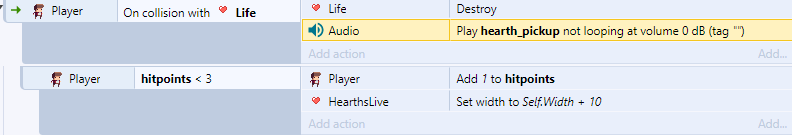

## Dois sons ao mesmo tempo e volume

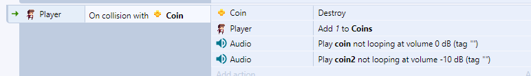

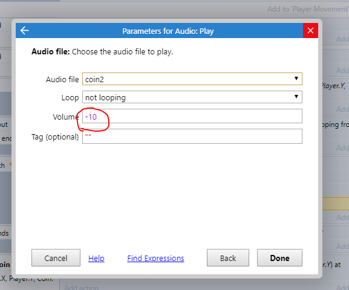

## Som de uma lista

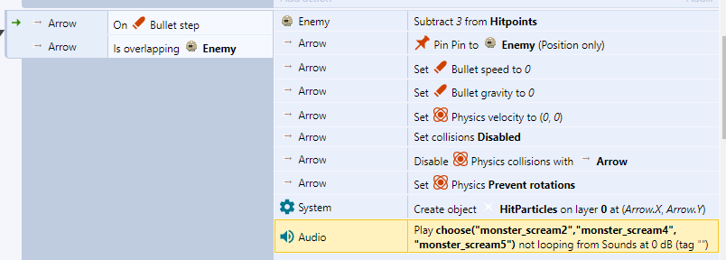

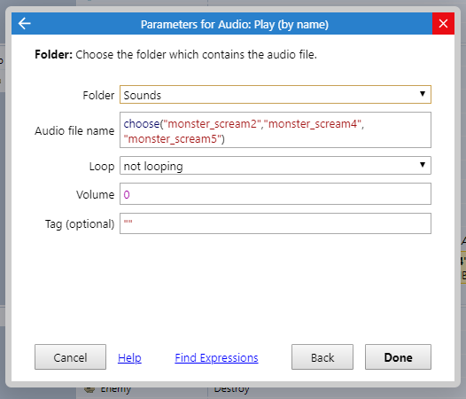

## Som em loop

Se você tem um tema que deseja tocar em loop, use o seguinte

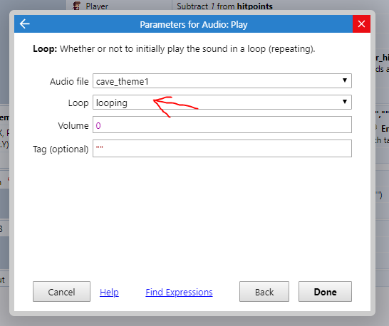

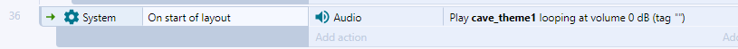

## Mais de um som em loop

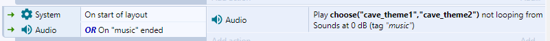

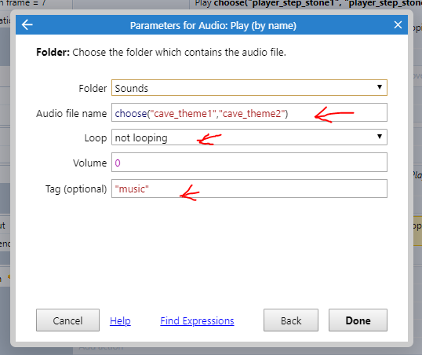

## Encadeando sons

## Adicionando delay

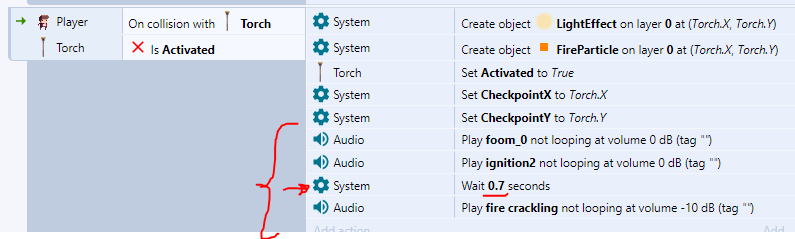

- **Obs.:** se for usar o delay, coloque os sons no fim do bloco

## Tocar em eventos que não são do tipo `On ...`

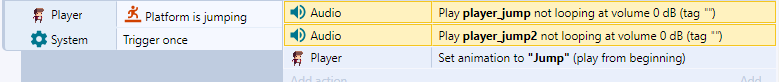

Fazemos o uso do `Trigger Once` para que o som não toque infinitamente enquanto o botão estiver clicado.

## Sincronizar som e animação

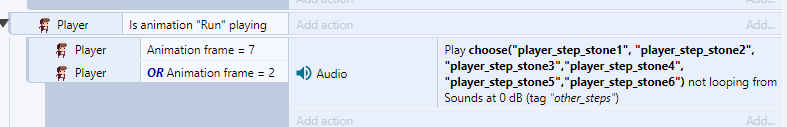

Nesse caso, o som dos passos irá tocar quando a animação `Run` estiver acontecento nos quadros `2` **ou** `7` que são os que o jogador está com o pé no chão.

## Tocar dependendo da distância

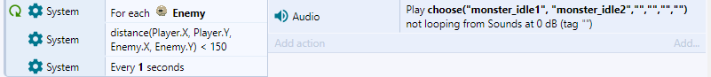

Nesse caso os inimigos só irão fazer som:

- Quando estiverem a menos de 150 pixels de distância do jogador.
- A cada um segundo, com uma chance de 2/6 de ter um som.