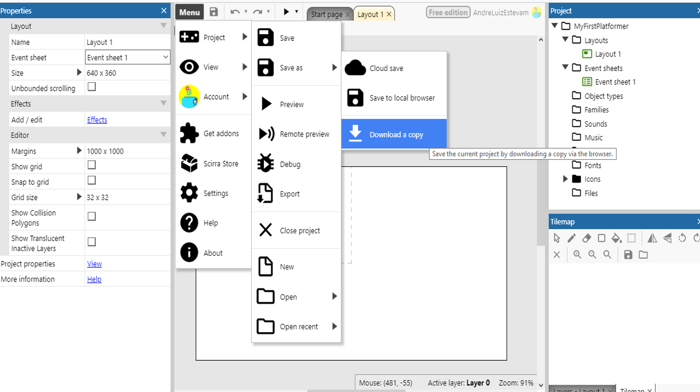
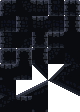

# Aula 1 - Começando com o Construct3

## Construct 3

---

[TOC]

## O que é?

* **Construct 3** é uma ferramenta para a criação de jogos **2D** voltada para **não programadores**;
* A versão 3 do Construct é baseada na plataforma web, ou seja, nada precisa ser baixado ou instalado no computador, o acesso pode ser feito por um *browser* atualizado como Google Chome, Mozila Firefox, Opera, Safari etc.;
* Foi desenvolvido pela **Scirra Ltda** e a primeira versão foi lançada em 2007;
* Permite a criação rápida de jogos por meio do sistema ***drag-and-drop*** (arrastar e soltar);
* No Construct entender a **lógica** de como um jogo funciona é **mais importante** do que saber alguma linguagem de programação já que o código do jogo é feito de forma **visual** por meio de **blocos**;

## Primeiros passos no Construct3
### Vendo exemplos
#### Jogos prontos
* A ferramenta pode ser acessada pela URL: [editor.construct.net](https://editor.construct.net);
* Se você preferir pode usar a versão desktop da ferramenta (download em: [C3 Desktop](https://downloads.scirra.com/c3-desktop/win64/construct3-win64-c64-stable.zip));
* Já na página inicial você pode encontrar alguns exemplos de jogos prontos e de modelos, os modelos são muito úteis para entender como alguns comportamentos simples funcionam;

*Exemplos de jogos prontos*

#### Modelos (*Templates*)

*Modelos para jogos*

Você pode clicar no ícone do projeto ou em *"Open project"* para abrir um desses projetos. Se ele for um modelo, você pode criar seu jogo tranquilamente se salvar como um jogo separado.

### Vamos começar...
#### Criando uma nova conta
Como usaremos a versão gratuita do Construct, é necessário que criem uma conta no site pois com uma conta e com o e-mail verificado algumas opções são desbloqueadas:

*Funções disponíveis na versão gratuita **sem login***:

*Funções disponíveis na versão gratuita **com login***

Para criar uma nova conta vá em `guest` e então em `register`:

*Menu para a criação da conta*

Preencha o formulário com um **nome de usuário**, **e-mail** (algum que você tenha acesso fácil já que um e-mail será mandado para ele) e uma **senha**:

*Formulário de criação de conta*

Você receberá um e-mail de confirmação (caso não receba não esqueça de verificar a lixeira)

 *E-mail recebido*

Abra o e-mail e clique no link de confirmação

*Mensagem*

*Conta verificada*

Agora volte para o site do Construct 3 e faça login na conta que você criou

*Botão de login*

*Campos de login*

#### Criando um novo projeto

Clique no botão `NEW PROJECT` e coloque as configurações conforme as da imagem, então clique em `Create`

* **Name**: "MyFirstPlatformer"
  * Pode ser o nome que você quiser, mas é melhor colocar algo que te ajude a encontrar o arquivo
* **Choose preset**: "Retro style"
  * Aqui é escolhida a resolução do jogo, como o jogo terá o estilo 16-bits, escolhemos o *RetroStyle*
* **Viewport size**: "320 x 180"
  * Esse valor não precisa ser alterado
  * Aqui é escolhida a área que a câmera do jogo vai "filmar", indica o tamanho do retângulo pontilhado que você vai ver a seguir
* **Orientations**: "Landscape"
  * A orientação do jogo define se a tela será mostrada na **Horizontal ou Paisagem** (*Landscape*), na **Vertical ou Retrato** (*portrait*) ou **Ambos** (*any*)
  * Como será um jogo para computador, definimos a orientação como **Paisagem**
* **Optimize for pixel art**:  [x]
  * O jogo terá um estilo retro, por isso marcamos a opção de otimizá-lo para pixel art

Clique em `Create` e a ferramenta de edição será aberta

#### Configurando o armazenamento em Nuvem

Antes de tudo, vamos configurar o armazenamento e salvamento automático do seu jogo em **nuvem**. Será guardado como um arquivo no seu **Google Drive**, **OneDrive** ou **Dropbox**. É preciso autorizar o Construct a salvar e ler os arquivos do jogo de uma dessas contas.

Vá em `Menu > Project > Save`

Nesse exemplo, será utilizado o Google Drive, mas os passos são muito semelhantes para as outras ferramentas.

Faça login em sua conta:

Permita o acesso do Construct3:

Use a ferramenta para criar uma nova pasta e salve o projeto nela:

Se você preferir, pode baixar uma cópia do jogo a qualquer momento e guardá-la com você, vá no seguinte menu:

Caso você queira carregar esse arquivo que baixou, use a opção `load from file` na página inicial:

e selecione o arquivo baixado

### Abas

Pronto, agora o projeto foi criado e o backup está configurado, vamos começar a entender a interface

Na ferramenta, existem dois tipos de abas:
* Layout
* Event Sheet

* Na aba **layout** é feito tudo relacionado a parte **gráfica** e **configurações** do jogo
* Na aba **event sheet** é feito tudo relacionado a **programação** do jogo

## Aba Layout

#### Área de Layout
No layout você perceberá que existem dois retângulos, um retângulo brando e uma área pontilhada dentro dele

O retângulo maior define a área onde seu jogo vai acontecer, essa área é chamada de **layout** ou **cena** do jogo, é importante concentrar seu jogo nela já que para deixar o jogo **mais rápido** e **economizar memória** é comum que se delete algum elemento do jogo que esteja **fora do layout**.

O retângulo menor com lados tracejados define onde a **câmera** do jogo começará, ou seja, quando você rodar o jogo, o que estiver **dentro do retângulo** será mostrado na tela, por conta disso, é interessante começar o jogo por ele.

#### Menu de Propriedades
Conforme objetos forem adicionados, quando você clicar neles as propriedades serão exibidas nesta janela.

#### Menu Projeto

Nesse menu ficam todos os arquivos do jogo, inclusive os mostrados nas abas de **Layout** e **Event sheet**.

**Dica:**

Caso as abas **Layout** ou **Event Sheet** desapareçam, use este menu para abri-las novamente, você pode dar um clique duplo ou usar o botão direito do mouse.

#### Tilemap

Este menu é utilizado para facilitar a criação do visual do seu jogo, você verá isso em detalhes nos próximos tópicos.

#### Layers

O jogo pode ser dividido em camadas, esse menu é utilizado para gerencia-las, usando esse esquema você pode colocar objetos atrás ou na frente do cenário principal e ter um controle melhor disso, podendo deixar transparente todos os objetos que estão em uma determinada camada, por exemplo.

**Dicas:** 

1. Se você tentou **mudar o cenário** e não conseguiu, verifique se o desenho do cadeado está marcado como fechado e clique para marca-lo como aberto, cadeado fechado indica que a camada não pode ser editada;
2. Se você percebeu que o cenário que estava fazendo **desapareceu**, verifique se a caixa de checagem antes do cadeado está desmarcada, caixas desmarcadas indicam que o que estiver naquela camada não deve ser mostrado na tela;

Vamos começar mudando o nome dessa camada, clique no nome dela para seleciona-la, você verá que o conteúdo do menu de propriedades mudará.

Vá no campo `name` e mude o valor dele de `layer 0` para `game` e aperte `enter` para confirmar:

#### Dicas
**Menus sumiram**

Se você perceber que algum dos menus citados anteriormente desapareceu, o coloque de volta usando o menu `menu > View > Bars`:

você perceberá que caso clique em um menu faltante (tirando os três últimos da lista que estão disponíveis apenas na versão paga do Construct) ele aparecerá na tela, você pode arrasta-lo para a posição que desejar.

**Nomes**

Sempre renomeie os objetos do jogo para o que eles representam, isso será muito útil e facilitará seu trabalho na hora da programação.

Use `F2` com o mouse sob o campo que quer editar ou use a ferramenta de renomear.

**Teclas de atalho e uso do mouse**

* Use a tecla `F11` para colocar ou tirar a ferramenta da tela cheia;
* Use `shift + roda do mouse` para dar zoom no cenário;
* `Aperte a roda do mouse e arraste` ou `espaço + arrastar o mouse`para se mover pelo cenário;
* Use a tecla `F2` com o mouse em cima de um campo de **texto** para editá-lo;
* `roda do mouse` para se mover na **vertical;**
* `shift + roda do mouse` para se mover na **horizontal;**
* `ctrl + e` para ir ao **event sheet;**
* `ctrl + l` para ir ao **layout;**

### Adicionando um Objeto ao jogo
Tudo dentro do jogo é representado como **objetos** de vários tipos, o **teclado** é tratado como um objeto assim como o **jogador** é tratado como um objeto, mas eles são de **tipos diferentes**, portanto, realizam **ações diferentes**.

Vamos inserir um objeto que representa o **teclado**. Clique com o `botão direito do mouse` e escolha a opção `insert new object`:

Você verá a lista dos tipos de objeto:

Existem muitos tipos de objetos:

* Objetos para guardar informações;
* Para representar **elementos visuais** dentro do jogo;
* Para interagir com o usuário desde com o teclado até com a webcam;
* Para se comunicar com a internet e com as redes sociais;

Para começar, procure o objeto `Keyboard` e dê um clique duplo nele para adicioná-lo ao jogo.
Você verá que ele foi adicionado à pasta de tipos de objeto.

Esse processo se repetirá para todos os objetos que adicionaremos ao jogo, alguns dos mais utilizados são:

* ***Sprite***: podem representar qualquer objeto no jogo, jogador, inimigo, cenário etc.;
* ***TiledBackground***: utilizado para colocar uma **imagem de fundo** no jogo, você pode partir de uma só imagem e fazer com que ela se repita como um **mosaico;**
* ***Tilemap***: utilizado para construir elementos de cenário, é comum que se coloquem os "blocos" que representam o cenário em uma só imagem, um *tilemap* permite separar cada bloco;
* ***Text***: utilizado para escrever textos no jogo;
* ***Spritefont***: funciona como o *text* mas a fonte é estilizada e tem como fonte um arquivo de imagem;
* ***Particles***: se baseia em uma imagem para criar partículas no jogo como fumaça, poeira ou fogo, por exemplo;
* ***Gamepad***, ***Keyboard***, ***Mouse*** e ***Touch***: são utilizados para interagir com os equipamentos que dão o nome a eles;

# Vamos começar
## *Background*

Adicione um novo objeto do tipo `Tiled Backgound`

Use a opção de pasta para selecionar o arquivo do computador.

Vá até a pasta onde estão os planos de fundo e escolha o arquivo `Background/tiled_bg.png`:

Com o arquivo importado, aumente o tamanho do *tiled Background* para que ele preencha todo o *layout* e um pouco mais.

As imagens de fundo são especialmente preparadas para que pareçam uma só quando colocamos várias delas lado a lado, funciona como um **mosaico**.

## Plataforma

Adicione um novo objeto da mesma forma como você fez antes, mas dessa vez escolha o tipo `Tilemap`

Abra o gerenciador de arquivos e selecione a imagem `Scenario/tilemap.png` 
Essa imagem possui vários blocos de 16 por 16 pixels que representam o **chão** do game

Assim como o *Tiled Background* aumente o tamanho do objeto para que ele fique maior que a tela.

**Dica:** ao mudar o tamanho de objetos, você pode apertar `Shift` e arrastar o mouse clicando em uma das abas para mudar o **tamanho** do objeto sem fazer com que ele seja distorcido.

Mude a aba inferior de *Layers* para *Tilemap*, passando o mouse por cima dos desenhos você verá que a seleção é maior que o tamanho dos blocos, precisamos mudar isso indo nas propriedades e mudando os atributos.

*  `Tile width` e `Tile heigh` para `16`

Agora você pode clicar em uma **célula** no menu *tilemap* e usar a ferramenta lápis para desenhar o cenário do seu jogo

*  Use para voltar ao mouse normal;
* Use para pintar o cenário;
*  Use para apagar algum erro;
* Use para pintar áreas maiores;
*  Use para espelhar a célula selecionada;
* Use para rodar a célula selecionada;

