# Aula 2 - Personagem, programação e plataformas

[TOC]

## Adicionando o personagem

Abra a janela de criação de objetos e escolha um do tipo `Sprite`

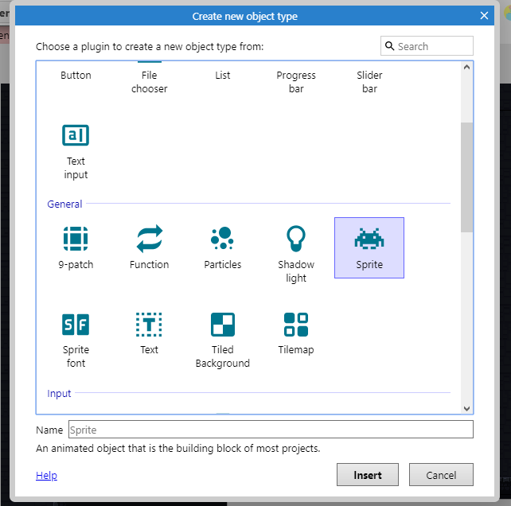

Abra o gerenciador de arquivos e escolha a imagem `Player\Decomposed\Idle\tile000.png` (). Na pasta você verá que existem outros arquivos para fazer a animação de quando o personagem está parado, faremos a animação mais adiante.


Clique na tela para adicioná-lo
Se você apertar o botão de executar verá que o jogador está flutuando
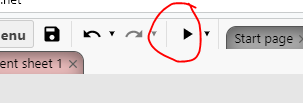


Isso acontece pois esse é um objeto do tipo ***Sprite***, que não tem um comportamento definido, precisamos dar a ele o comportamento de **plataforma**

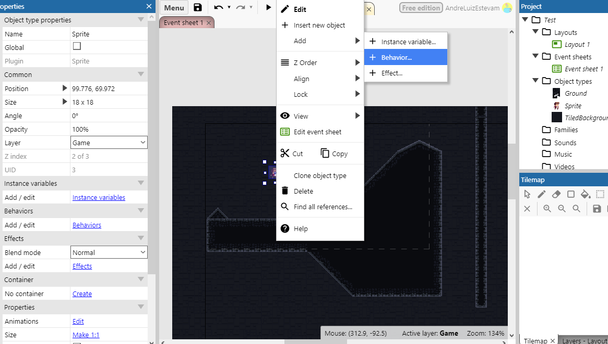 


Se você apertar o botão para executar agora verá que o player irá atravessar o chão e cair para o infinito, isso acontece já que precisamos dar ao **chão** algum **comportamento** que permita a interação com o jogador


Use o menu lateral para selecionar o *Tilemap* e entre no menu *Add behavior*, antes disso, aproveite para renomear os objetos para o que eles irão representar no jogo

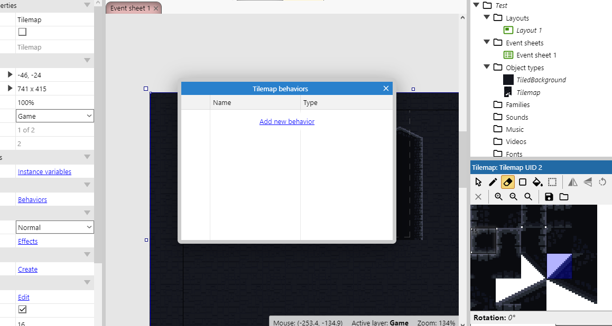

Aplique o comportamento `Solid`


Agora o jogador e o cenário podem interagir um com o outro, mas você perceberá que existem vários problemas

* Em alguns lugares o jogador atravessa o chão ou fica flutuando em cima dele
* O jogador está muito rápido e pula muito alto (até sai da tela)
* Não existe animação de andar, pular ou olha para o lado certo


Vamos resolver esses problemas

### Box collision

Para determinar se um objeto está encostando em outro usamos um conceito chamado ***Box collision*** ou ***Collision Polygon***, como seria muito complexo para o computador usar as imagens que colocamos para determinar se dois objetos estão se tocando, ele desenha um polígono em cima desses desenhos para simplificar esse teste
No caso do chão, o construct colocou um **quadrado** como polígono, sendo que algumas formas são **triangulares**
Procure os ***tiles*** que não completam o quadrado completamente e dê um clique duplo em um deles
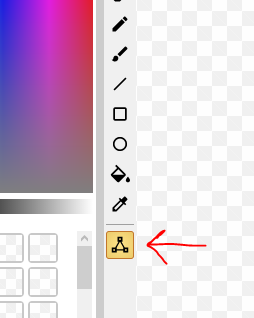

Clique no ícone da ferramenta de editar o polígono de colisão


Você pode **arrastar os quadrados vermelhos** para mudar a forma do polígono. Dê um duplo clique em um deles para gerar mais um e clique uma vez e aperte `Delete` ou `Backspace` para removê-lo

Faça esse processo para todos os *tiles* que não forem quadrados completos.
Precisamos repetir o mesmo processo para o *sprite* do jogador


Agora se você executar o jogo vai ver que a interação entre o personagem e o mapa está muito melhor
### Mudando as propriedades do *Player*


Aqui estão alguns valores recomendados, você pode escolher os que quiser para seu jogo, mas é importante escolher com sabedoria já que você pode precisar reconstruir o cenário todo caso mude a forma como o jogador se move.

Note também que existe uma barra na parte inferior que diz o que o campo selecionado faz.

### Adicionando animações

Dê um clique duplo no personagem. Note que há uma barra lateral indicando quais animações o personagem tem e uma outra na parte inferior mostrando os frames da animação corrente.

Vamos começar com a animação de quando o jogador está parado, mude o nome da única animação existente para `idle`


Na área dos frames escolha a opção `Import Frames > From Files` para dizer que iremos importar os frames da animação cada um de um arquivo

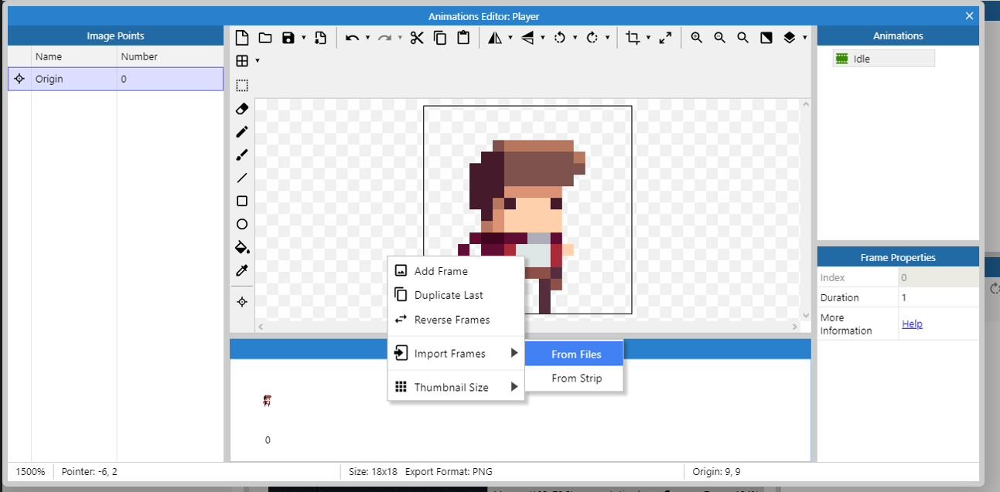

Selecione os arquivos em `Tiles\Player\Decomposed\Idle` e delete o quadro de número zero já que ele é o que estava anteriormente

Você pode usar a opção `Preview` para ver como a animação está


Como você pode ver, a animação acontece apenas uma vez e está muito lenta, vamos alterar isso.


Com a animação `Idle` selecionada, vamos definir a velocidade como `8` frames por segundo e vamos marcar a opção de loop


O mesmo processo deve ser aplicado para as animações


* Idle
  * Speed: 8
  * Loop: sim
* Shoot
  * Speed: 20
  * Loop: não
* Jump
  * Speed: 5
  * Loop: não
* Fall
  * Speed: 5
  * Loop: não
* Run
  * Speed: 14
  * Loop: sim


### Editando a *Collision Box*

Como adicionamos mais animações precisamos definir as caixas de colisão para elas, dessa vez faremos um trabalho mais preciso.

Segurando a tecla `ctrl` clique nos dois quadrados vermelhos acima do personagem, você vai selecionar ambos e eles ficarão amarelos, use a seta para baixo para mover a linha até a cabeça do personagem


Repita o processo para os outros lados desta forma:


Agora clique no personagem com o botão esquerdo do mouse e escolha a opção `Apply to all animations`


Agora todas as animações usarão esse mesmo polígono


### Mudando a origem

Para garantir que todos os frames fiquem alinhados e para fazer o efeito de poeira saindo dos pés do personagem (que faremos logo a seguir) precisamos mudar a origem da imagem. O ponto de origem é o ponto utilizado para alinhar os frames de uma animação, vamos colocá-lo nos pés do personagem.


Use a opção para colocar o ponto de origem na parte de baixo da imagem


Agora aplique essa mudança para todas as animações

### Adicionando partículas

Vamos colocar um efeito de poeira quando o jogador cair no chão, para começar, adicione um novo objeto do tipo *Particles*


Clique na tela para adicionar o objeto, na janela que irá abrir selecione o arquivo `Particles/playerdust.png`

É importante que esse objeto esteja no jogo mas **não esteja visível** , ou seja, ele deve estar **fora do layout**, quando precisarmos dele faremos que apareça nos pés do jogador.


Renomeie o objeto para podermos programar com ele mais facilmente mais tarde

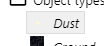


Use a opção `Z Order > Send to top of layer` para traze o objeto para o topo da camada fazendo com que efeito apareça **na frente** do personagem
Defina as propriedades conforme a seguinte imagem


## Aba Event Sheet

Nesta aba é onde ficará o código que definirá os **comportamentos do jogo** por meio de **eventos**

Um evento é uma **condição** ligada a um ou mais **objetos** do jogo, por exemplo: no game, o teclado será representado por um **objeto** do tipo **Keyboard**, pois são os **objetos** que podem lançar **eventos**, assim, podemos no código monitorar por algum **evento específico**, nesse caso, pode ser quando alguma tecla for pressionada ou solta, então podemos executar alguma ação quando esse evento ocorrer.


Alguns eventos comuns são:

* Quando algum objeto do jogo está tocando outro
  * Inimigo tocou no jogador: tirar pontos de vida do jogador
  * Jogador tocou em uma moeda: faça a moeda sumir e adicione na pontuação do jogador
* Quando o jogador está andando, pulando ou parado
  * Mude para a animação correspondente


**Lembre-se:**

1. Um evento é qualquer acontecimento dentro do jogo
2. Posso criar um código que é ativado quando um evento ocorrer
3. Posso decidir quais ações devem acontecer quando esse evento for acionado

Você pode criar um evento clicando em `Add event`


Será te perguntado a **condição**, ela tem que estar relacionada a um dos **objetos** do jogo


Uma lista de **eventos** daquele **objeto** aparecerá, você pode escolher qual deles você quer monitorar


Existem dois tipos de eventos

* Eventos que **não começam** com `On`
  * As **ações** serão executadas **enquanto** a **condição** for verdadeira
  * Se a ação for fazer o personagem pular, ele irá pular **repetidamente** até você soltar a tecla
* Eventos que **começam** com `On`
  * As **ações** são executadas na **primeira vez** que a ação for verdadeira, ou seja, apenas **no instante** que o evento ocorrer
  * Se a ação for fazer o personagem pular, ele irá pular **uma vez** e só pulará novamente se você soltar a tecla e apertá-la novamente


### Tipos de eventos

#### Evento do tipo *AND* / E

Você pode precisar que mais de um evento esteja acontecendo ao mesmo tempo para executar algum bloco. Quando existe **mais de uma condição** e precisamos que **todas** sejam verdadeiras, usamos o *AND*

Inserindo uma nova condição


Outra forma de fazer isso


Um bloco do tipo *AND* fica dessa forma


#### Evento do tipo *OR* / *OU*


Num evento do tipo *OR* , o bloco é executado quando **uma ou mais** condições são verdadeiras.

Para fazer um bloco *OR* você precisa começar por um do tipo *AND* e usar a opção `Make OR block`


Ele ficará assim:


Você pode torná-lo um bloco *AND* usando a seguinte opção:


#### Invert

Caso você queira que o bloco **seja executado** quando uma condição **não** for verdadeira, use a opção *invert*

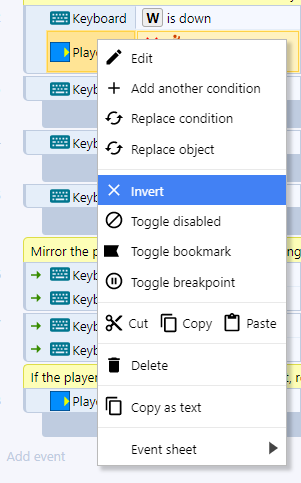


Um bloco com um invert fica assim:


Perceba que na imagem existe uma junção do bloco *AND* com o *invert* nesse caso, você pode ler essa condição como:


*"Execute as ações a seguir **se** A tecla *W* do teclado estiver sendo apertada **E** o player **Não** estiver pulando"*


#### *Else* (Senão)

Um bloco do tipo *else* é executado quando o que foi testado em um evento não ocorreu: você pode fazer o teste de algo e o seu inverso em um mesmo bloco.


Um bloco else é criado dessa forma:


O resultado será:


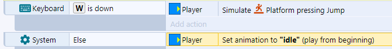


Você pode ler o *else* como: *Execute essa ação se algo acontecer, **caso contrário** execute outra ação*


#### Subeventos

Subeventos são maneiras de condesar o código e evitar repetição. imagine que você tem que programar o seguinte:


*Se o jogador encostar numa alavanca um som deve ser tocado, se ele apertar a tecla `x` a alavanca deve mudar de posição*


Sem o uso de sub eventos a solução poderia ser assim:


```
SE (jogador está encostando na alavanca):
	toque o som
SE (jogador está encostado na alavanca E a tecla x está sendo apertada):
	mude a posição da alavanca
```


Veja que uma das condições se repete, podemos  condensar isso usando um subevento da seguinte forma:


```
SE (jogador está encostando na alavanca):
	toque o som
	SE (tecla x está sendo apertada):
		mude a posição da alavanca
```


Para criar um subevento use:


# Começando a programação


Primeiramente, vamos criar um grupo para conter os movimentos do jogador, isso será importante pois precisaremos desativar todos os movimentos na hora do jogador atirar a flecha

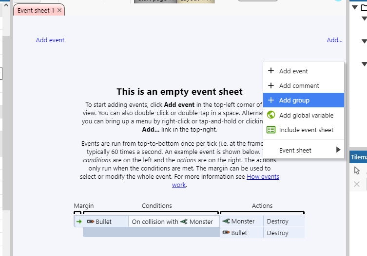


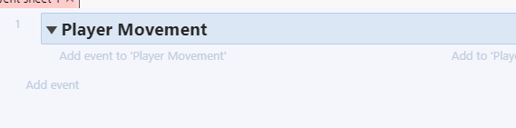


Como vamos adicionar os eventos ao grupo *Player Movement*, precisamos usar a opção `Add event to 'Player Movement'`


Selecione o *Player*, a condição vai ser baseada nele


Vamos começar criando o bloco onde a animação do jogador correndo será ativada quando ele estiver se movendo e estiver no chão, assim a animação de correndo não acontecerá quando o jogador estiver pulando


Se você executar o jogo agora vai ver que o jogador passa para a animação de correr quando as teclas direcionais são apertadas, mas não volta para a animação de parado. Isso não foi programado ainda...

**Dica:** agora é uma boa hora para rever a velocidade máxima que o player pode chegar e a velocidade da animação dele correndo para que os dois fiquem em sincronia.


### Fazendo o player parar


### Fazendo o player olhar para a direção correta


Se você não tem o Objeto *Keyboard* adicionado ao projeto, adicione-o


Crie um novo evento partindo do objeto teclado e escolha o evento `On key pressed` e aperte a seta para a esquerda para definir que queremos que código seja executado quando a tecla para a esquerda for pressionada


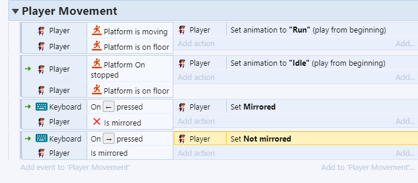

### Pulando, caindo e poeira


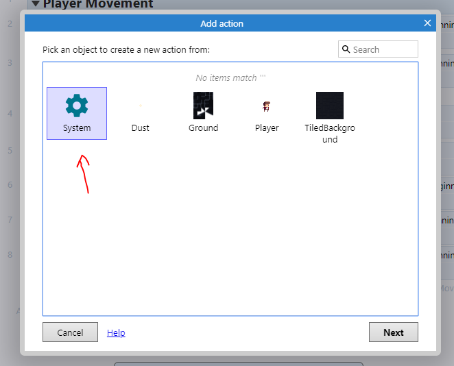


### Como o Construct executa a *event sheet*?


É preciso lembrar que, no Construct, todas as ações programadas precisam ser precedidas por um evento, pode-se dizer que, quando algo acontece no jogo um evento é disparado no código e ações são tomadas.

Mas como o jogo **sabe** que alguma ação aconteceu no jogo?

É simples, você pode enxergar a *event sheet* como uma lista de condições, o construct percorre todas elas em *loop*, testando se alguma condição é **verdadeira** se for, as ações associadas a essa condição são executadas.

O tempo para percorrer todo o código é chamado de ***tick***, é um conceito parecido com o **FPS** (*frames per second*) de um jogo ou vídeo, onde um **frame**  representa uma das **foto** instantânea em cada momento do jogo, então, mais FPS representam mais fotos por segundo, da mesma forma, em um computador mais rápido, o código é executado em menos tempo e o tempo entre um **tick** e outro é **menor** então em poucos segundos cabem **mais** ticks.


# Câmera

Nossa câmera será representada por um objeto do tipo *Sprite*, precisamos:

* Criar um novo sprite
* Pintá-lo de uma cor para que possamos vê-lo durante a programação
* Mudar seu nome para `Camera`
* Marcar em suas propriedades que quando o jogo iniciar deve ser invisível
* Fazer a programação associada


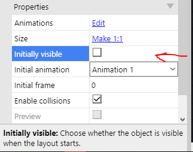


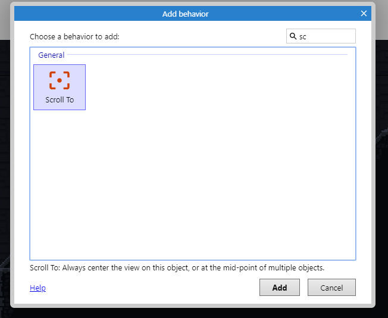


Vamos adicionar um evento do tipo `System > Every tick` **fora** do grupo `Player Movement`


Para suavizar o movimento da câmera vamos usar a função `lerp`, ela causará um atraso no movimento da câmera num fator de `0.03`  ao ir da posição `x,y` de onde está (`Self`) até a posição `x,y` do jogador (`Player`)


Uma função na programação funciona de maneira muito parecida com uma função na matemática, uma função é algo que:


Tem um nome e recebe um valor de entrada como:
$$
f(15)
$$


Faz algum cálculo baseado em uma fórmula:
$$
f(x) = 3x + 2
$$
E retorna algum valor como saída
$$
y = f(15) = 3 * 15 + 2
$$

$$
y = 45 + 2
$$

$$
y=47
$$


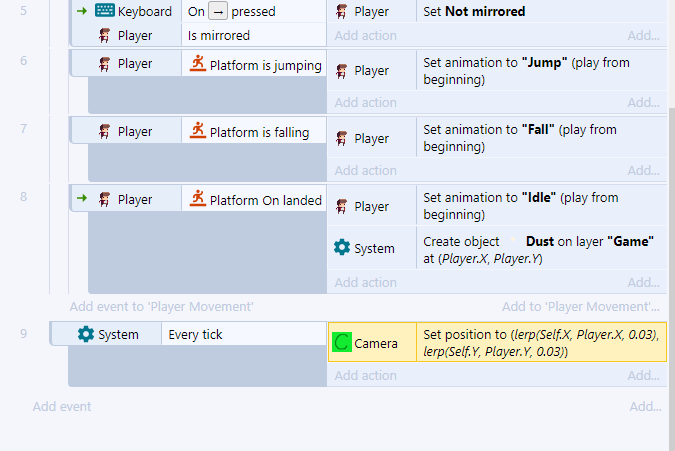


Uma forma mais simples de fazer a câmera (mas não tão boa):


