# Aula 3 - Colecionáveis

[TOC]

# Colecionáveis

## Parte visual

Crie um objeto do tipo *Sprite* para representar as moedas, crie duas animações com base nas imagens em `Items\Coin_spin` e `Items\Coin_shine`

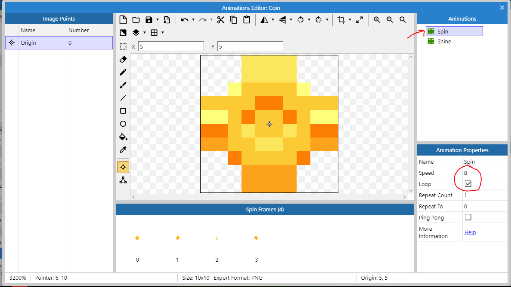 

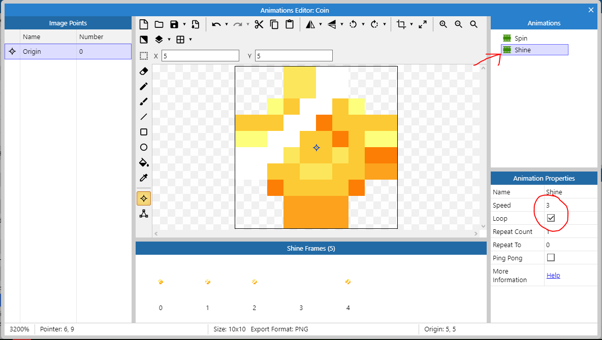

Defina a caixa de colisão para as moedas e use a opção de aplicar para todas as animações, assim como fizemos com o Player anteriormente.

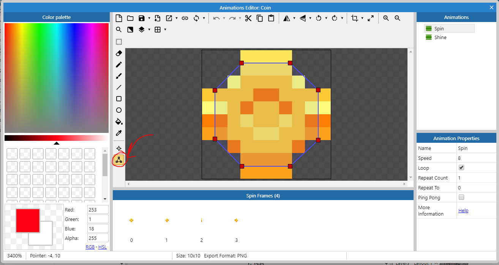

Dê um duplo clique  em um dos quadrados vermelhos para adicionar um outro ponto **antes** dele

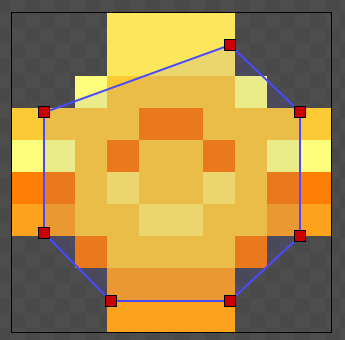

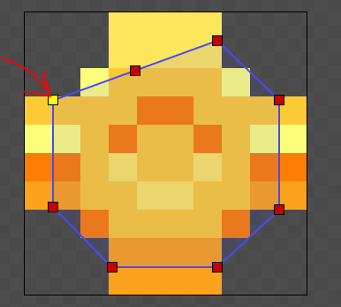

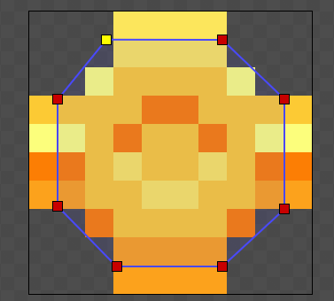

Aplicando para todas as animações:

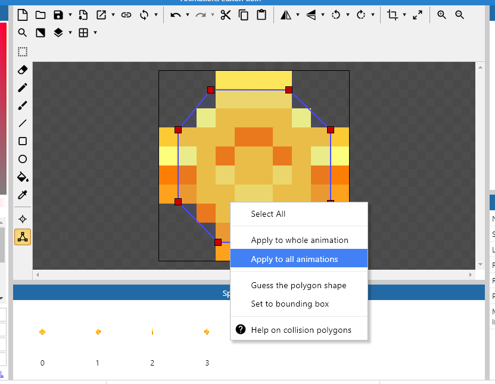

Você pode usar a mesma técnica para duplicar objetos ensinada anteriormente (clicar no objeto a copiar, segurar a tecla `ctrl` e arrastar o mouse) e definir qual vai ser a animação que deve ocorrer na moeda da seguinte forma:

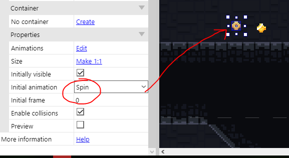

## Parte Lógica

O primeiro passo é criar uma variável de instância ao Player. Uma variável de instância é um campo que nos permite guardar um valor como um número ou um texto junto com algum objeto, nesse caso o objeto *Player*

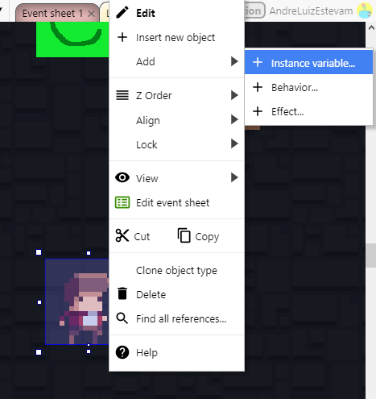

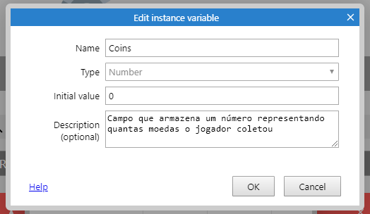

Nosso objetivo é criar esse bloco:

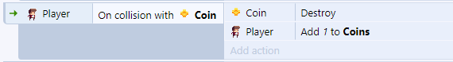

Para a primeira linha escolha `Coin > Destroy`

Para a segunda use o `Player > Add to` conforme as imagens

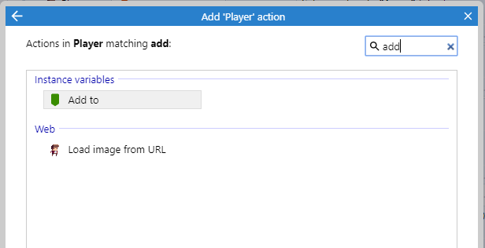

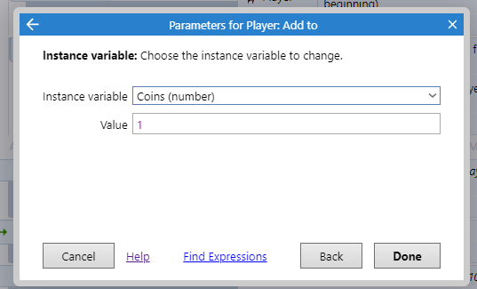

Você pode querer colocar o efeito de física na moeda, com ele é possível fazê-la interagir com as flechas que o jogador vai lançar e colocar o efeito delas sendo "sugadas" em direção ao jogador quando ele se aproximar delas.

Para isso você precisará:

1. Aplicar o comportamento `Physics` às moedas

2. Aplicar o comportamento de física ao cenário e garantir que a opção `Immovable` está marcada

3. Criar o seguinte bloco que fará as moedas serem atraidas para o jogador

Para isso, faça o seguinte

Crie um novo evento do tipo `System`

Escolha a opção `for each`

Escolha a opção `Coin`

No bloco criado, escolha a opção `Add another condition`

Escolha system novamente

Escolha a opção `Compare two values`

Coloque os seguintes valores

O `for each` executará esse código para cada moeda e testaremos para cada uma delas se a distância no plano cartesiano entre ela e o jogador é menor que 40 px, se for ela irá na direção dele:

Para fazer a moeda ser sugada, faremos o seguinte:

`dt` é a quantidade de ticks que o jogo tem, em computadores mais rápidos, o tick é menor, em mais lentos é maior, como a força será aplicada a cada tick, precisamos garantir que ela será a mesma para computadores mais rápidos e mais lentos, assim, com `3 * dt` fazemos com que:

* Num computador mais **lento** a ação de aplicar uma força que acontece **menos vezes** ocorra com **mais força**
* Num computador mais **rápido** a ação de aplicar uma força que acontece **mais vezes** ocorra com **menos força**

Dessa forma o efeito será o mesmo independentemente da plataforma.
