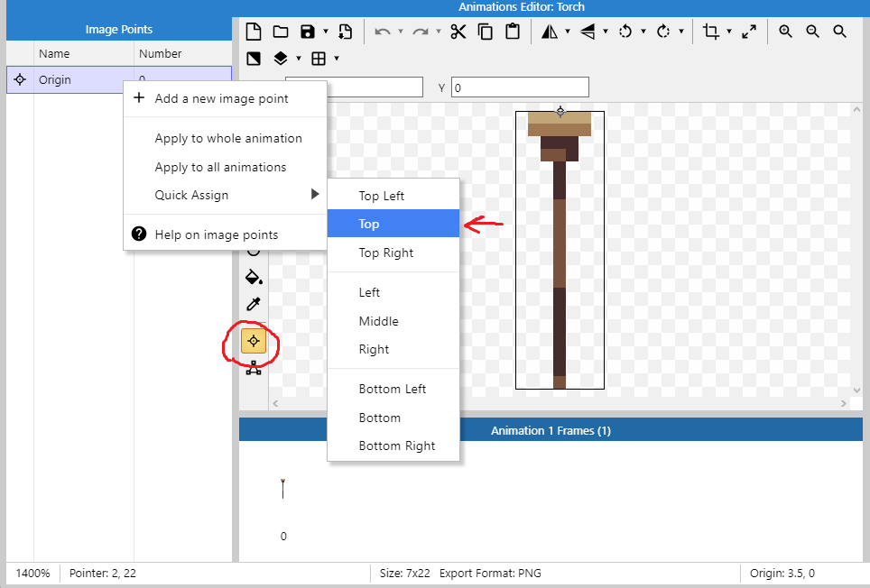
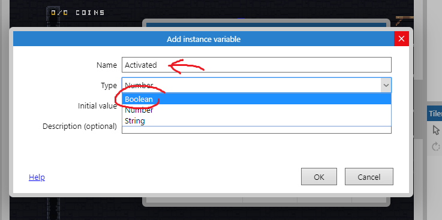
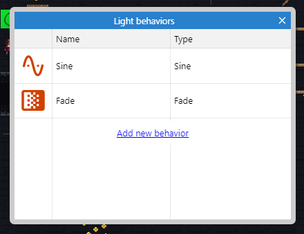
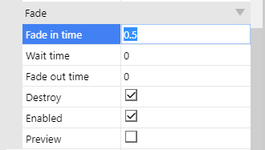
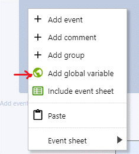
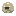
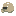
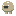
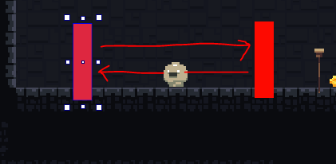
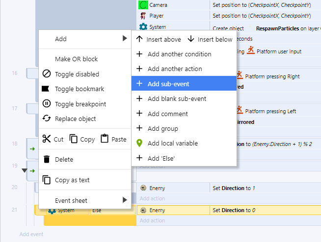

# Aula 4 - 

[TOC]

# *Checkpoints*

*Checkpoints* são locais onde o jogador pode renascer caso tenha morrido, assim ele não perderá o progresso que fez no jogo até aquele ponto.

Nossos *checkpoints* serão representados por tochas que podem ser acendidas ou apagadas. Uma tocha acendida indica que o jogador já passou por aquele *checkpoint* e uma tocha apagada indica que ainda não passou. Vamos dar a ideia de que o jogador está acendendo as tochas ao tocar nelas.

Por fim, quando o jogador morrer, deverá reaparecer na **última** tocha que acendeu.

Vamos começar pela parte visual, precisaremos de três arquivos, dois deles serão objetos do tipo *Sprite* (a tocha e a luz ao redor dela) e um dele será um objeto do tipo *Particles* (o fogo)

Vamos adicionar a tocha, adicione um novo objeto do tipo `Sprite` e coloque a imagem que está no arquivo `Scenario/torch-sheet0.png` 

Nós iremos fazer partículas que representam fogo aparecerem no topo da tocha, para isso usaremos o ponto de origem, por isso, precisamos deslocá-lo para o topo da imagem, A forma mais simples de fazer isso é indo no menu de edição dos pontos, clicar com o botão direito do moude em `Origin` e escolhendo a opção `Quick Assign > Top`

Defina o nome desse objeto como `Torch`

Vamos adicionar uma **variável de instância** ligada a cada tocha, ela indicará se a tocha está acesa ou apagada, seu nome será `Activated`

Clique na opção `Add new instance variable`, coloque o nome para a variável e defina o tipo como `Boolean`

Agora vamos adicionar um outro objeto do tipo `Sprite` para fazer o efeito de iluminação, use a imagem em `Visual Effects\light-sheet0.png`

Defina o nome desse objeto como `LightEffect`

Nela vamos aplicar alguns comportamentos e efeitos:

Os comportamentos `Sine` e `Fade`, o primeiro dará uma ondulação na quantidade de luz e o segundo tornará possível que façamos um efeito de *fade-in* quando a luz aparecer

O efeito `Dodge` para mesclar a imagem com o fundo do jogo

Nas propriedades, as seguintes alterações devem ser feitas

No comportamento `Sine`:

No comportamento `Fade`:

Agora adicione um novo objeto do tipo `Particles`, ele deverá se chamar `FireParticles`. Encontre a imagem para o objeto em `Particles/col_fire.png` 

Vá nas propriedades dele e coloque o seguinte:

Apenas a imagem da tocha deve ser mostrada no jogo, as outras **devem estar no layout** mas **fora** da área que o usuário pode ver.

Vamos fazer a parte da programação. Primeiramente precisamos criar duas variáveis globais do tipo `number`, `CheckpointX` e `CheckpointY` elas armazenarão a posição X,Y do último *checkpoint* que o jogador ativou permitindo que ele renasça lá caso morra.

Agora faremos com que quando o jogador tocar em uma tocha que não foi ativada ainda ela seja marcada como novo checkpoint e comece a queimar.

Esse código deve fazer:

*Quando o jogador encostar em uma tocha **e** essa tocha não estiver ativada:*

1. *Crie o efeito de luz no ponto de origem da tocha* (ele será criado com um efeito de fade e no topo da tocha, já que colocamos lá o ponto de origem)
2. *Crie as partículas que fazem o fogo ponto de origem da tocha*
3. *Troque o estado da tocha para ativada* (se não fizermos isso mais fogo e mais efeitos de luz serão criados por cima dessa tocha quando o jogador tocar nela novamente)
4. *Defina a variável global `CheckpointX` para a posição `X` da tocha que o jogador acabou de encostar*
5. *Defina a variável global `CheckpointY` para a posição `Y` da tocha que o jogador acabou de encostar*

Quando você fizer isso e executar verá que, no jogo, as tochas que o jogador tocar se acenderão. Mas temos um problema, onde o jogador deve renascer caso ele morra antes de tocar em qualquer tocha? Vamos fazer com que a tocha mais próxima dele seja o checkpoint assim que o jogo começar, então lembre-se de colocar uma tocha ao lado dele no seu cenário, caso contrário o jogador pode se matar no começo do jogo para aparecer num checkpoint distante.

As condições são:

*Quando o layout começar, pegue o objeto Torch mais próximo da posição X,Y do jogador*

O código a executar é exatamente o mesmo do bloco anterior, você pode copiar e colar. Você perceberá que a tocha mais próxima do jogador será acesa sozinha ao iniciar o jogo.

Agora precisamos introduzir alguma forma do jogador morrer para testarmos se os checkpoints funcionam, faremos com que o jogador morra caso caia fora do cenário.

Vamos adicionar um efeito visual quando o jogador renascer, precisamos criar um novo objeto do tipo `Particles` com a imagem `Particles/torch_fireyellow.png` com o nome `RespawnParticles`

As propriedades devem ser as seguintes:

O programa deverá ser o seguinte:

*Quando o jogador estiver fora do layout*

1. *Ativar a opção de ignorar os comandos de movimento* (Evita que o jogador se mova enquanto está caindo ou logo após renascer)
2. *Defina o vetor de velocidade no eixo X como 0* (Evita que o jogador caia muito rapidamente ao renascer)
3. *Defina o vetor de velocidade no eixo Y como 0* (Evita que o jogador ande para os lados ao renascer caso tenha morrido correndo)
4. *Mova a câmera para o checkpoint*
5. *Mova o jogador para o checkpoint*
6. *Crie o objeto `RespawnParticles` aonde o jogador está*
7. *Espere meio segundo*
8. *Permita que o jogador se mova*

Note que o personagem deve morrer quando cair para fora do layout, isso inclui

* Pular e cair infinitamente
* Ir até o fim do jogo para a direita ou para a esquerda
* Pular muito alto (ultrapassando o fim do layout)

Por isso, é necessário que você impeça ele de pular muito alto adicionando um teto ao jogo, caso contrário ele pode morrer por pular para fora do cenário. Uma outra alternativa é deixar o fim do jogo bem alto de forma que se o jogador escalar no ponto mais alto do jogo e pular, ainda não alcançará o fim do layout

**Dica:**

Clique na parte cinza (fora de qualquer objeto), na aba de propriedades serão mostradas as propriedades do projeto como um todo, marque a opção `Show Grid`, `Snap to Grid` e defina `Grid size` como `16x16` (ou o tamanho dependendo do projeto, normalmente `16x16`, `32x32`, `64x64` ou `128x128`)

Caso ache interessante, pode ativar a opção `Show Collision Polygons` que mostrará os polígonos de colisão dos objetos no jogo.

# Redimensionando o cenário

Agora que temos vários dos itens que irão compor o jogo, podemos começar a pensar e construir um cenário em definitivo, algumas dicas são:

* Tenha um esboço feito de antemão, com ele tente deduzir
  * A largura do cenário
  * A altura do cenário
* Quando for pintar o cenário, comece do centro esquerdo

* Sempre adicione paredes e um teto para evitar que o jogador mora por pular muito alto, por exemplo.

Para redimensionar, clique na parte cinza do layout (fora de qualquer objeto), as propriedades do projeto em si aparecerão na lateral.

Mude o atributo `Size` dependendo do tamanho do cenário que você pensou, lembre-se de que cenários muito grandes deixarão o jogo mais lento.

# Inimigos

Vamos começar a criar um inimigo simples que patrulhará uma área. Crie um novo objeto do tipo `Sprite` e crie uma animação com as imagens em `Enemy\PatrolSlimePatrol\`. O nome desse objeto deve ser `Enemy`.

Crie a caixa de colisão para ele e aplique a todos os quadros da animação

Dê um nome para a animação, defina a velocidade e marque a caixa de loop

Você precisará adicionar as seguintes variáveis de instância

A variável `Direction` será utilizada para definir a direção que o inimigo deve andar e a variável `Hitpoints` guardará a vida do inimigo.

`Direction` deverá receber o número `0` ou o número `1,` `Hitpoints` deverá receber quantos pontos de vida o inimigo vai ter contando com a força do ataque do jogador. Como quero que o inimigo morra com 3 ataques de uma arma mediana, defini este valor como `9`, cada ataque do jogador tirará `3` pontos de vida, assim, serão precisos `3` ataques.

Agora adicione mais um objeto do tipo `Sprite` e pinte-o de vermelho ou qualquer cor que se destaque.

Dê o nome de `EnemyFence`. Esse objeto definirá a área que um inimigo deve fazer sua patrulha, elas ficarão invisíveis no jogo e quando um inimigo tocar em uma delas irá passar a patrulhar no sentido oposto.

Algumas configurações no sprite `Enemy` devem ser feitas, adicione o comportamento `Platform` e defina as seguintes propriedades

Não se esqueça de **desmarcar** a opção `Default Controls`, assim será possível controlar o movimento do inimigo pelo programa e não com o teclado.

Coloque as barreiras ao redor da área de patrulha do inimigo e vamos começar a configurar a lógica dela. Crie estes blocos:

Caso a variável `Direction` seja `0` o inimigo andará para a **Direita**, caso seja `0` andará para a **Esquerda**. Precisamos fazer com que se o inimigo tocar na barreira o número em `Direction` mude de `0` para `1` ou de `1` para `0`.

Existem duas formas de fazer isso, essa é a mais simples de entender, mas gasta mais eventos.

*Quando o inimigo colidir com a barreira:*

	*Se o conteúdo em `Direction` for `0`*:
	
		*Mude o valor em `Direction` para `1`*
	
	*Caso contrário*
	
		*Mude o valor em `Direction` para `0`*

Para adicionar a condição e o *else* você precisará ir em `Add new > Sub event` 
Para adicionar a condição e o *else* você precisará ir em `Add new > Sub event` 
Para adicionar a condição e o *else* você precisará ir em `Add new > Sub event` 

Dessa forma o inimigo patrulhará entre as duas cercas. Se você quiser poupar a quantidade de eventos pode fazer o seguinte:

Na fórmula `(Enemy.Direction + 1) % 2`  estamos usando algo chamado **operação modular** não é fundamental que você a compreenda mas saiba que ela causa o mesmo resultado que a operação anterior.

Caso queira saber mais sobre o operador módulo veja:

[Khan Academy - Aritmética modular](https://pt.khanacademy.org/computing/computer-science/cryptography/modarithmetic/a/what-is-modular-arithmetic)

[TI Expert - O que é a operação módulo?](http://www.tiexpert.net/programacao/algoritmo/modulo.php)

