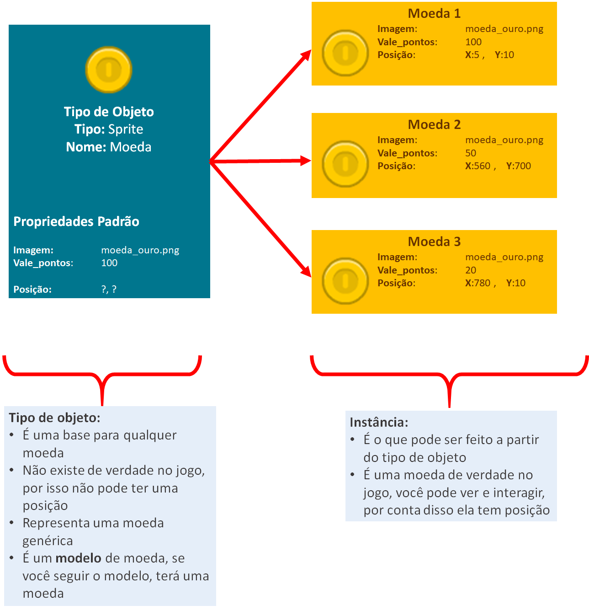
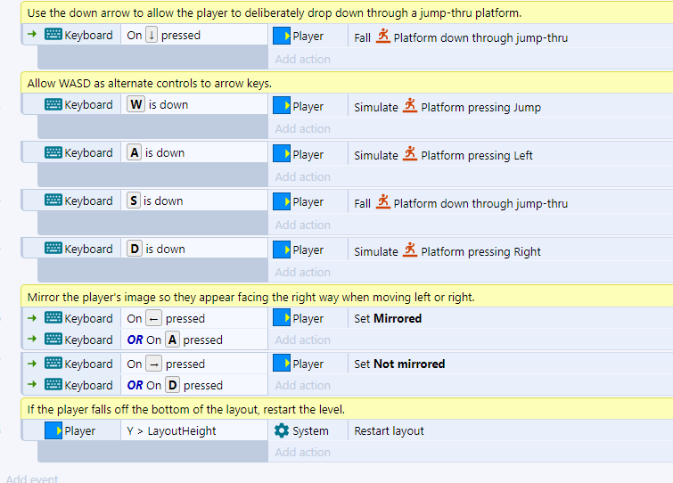
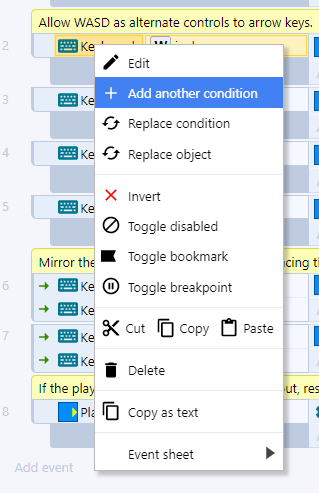
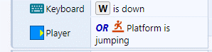

# Programação de Jogos com o Construct -  Parte Teórica

[TOC]

## Introdução

### O que é programação?

Programação é o uso de uma **linguagem** que o computador possa **compreender** de forma a resolver problemas.

Um programa é uma **série de passos** ou **instruções** que devem ser executados pelo computador.


**O que pode ser feito com programação?**

- Criar jogos
- Criar programas para sistemas operacionais
- Criar sistemas operacionais
- Criar programas para fazer suas tarefas no dia-a-dia para facilitar seu trabalho
- Consertar problemas em sistemas operacionais/programas
- Invadir redes, sistemas, sites e computadores pessoais (hackear)
- Adicionar funcionalidades que você desejar em sistemas operacionais/programas
- Muitas outras coisas

https://www.programacaoprogressiva.net/2012/08/serie-comece-programar-2-o-que-e.html

### O que é programação de jogos?

A programação de jogos é uma sub-área da programação que lida com a criação de **jogos eletrônicos**. Para fazer um jogo você precisa pensar em coisas como:

* **Uma ideia inicial**: *"meu jogo é um jogo de..."*
* **Uma história**: *"No meu jogo vai acontecer isso, depois isso e então aquilo..."*
* **Uma linguagem de programação**: usando uma linguagem de programação você pode **dizer** ao computador qual **operação** você quer que ele faça, mas assim como você pode dizer a mesma coisa em diferentes **línguas**, só que de forma diferente, na programação acontece o mesmo, você pode dizer  quais passos o computador deve seguir usando as **regras** de uma linguagem de programação.
* **Imagens, sons e músicas**: como jogos são visuais, você precisará procurar, comprar ou fazer a parte audiovisual que irá utilizar

### O que é o Construct3?

- O **Construct 3** é uma ferramenta para a criação de jogos **2D** voltada para pessoas que **não conhecem programação**
- A versão 3 do Construct é baseada na plataforma web, ou seja, **nada precisa ser baixado ou instalado no computador**, o acesso pode ser feito por um *browser* atualizado como Google Chome, Mozila Firefox, Opera, Safari etc.;
- Foi desenvolvido pela empresa **Scirra Ltda** e foi lançado em 2007;
- No Construct entender a **lógica** de como um jogo funciona é **mais importante** do que saber alguma linguagem de programação já que o código do jogo é feito de forma **visual** por meio de **blocos**;


## Tipos de Objetos

### Visual x Lógico

No Construct, a construção do jogo é **dividida em duas partes**

Uma parte **visual** e uma parte **lógica**

Essas partes podem ser acessadas por essas duas abas:


Chamamos a parte visual de ***Layout*** e a parte lógica de ***Event sheet***


### Tipos de Objeto (*Object Type*)


Todo jogo é feito pela **manipulação** de **instâncias** e **tipos de objeto**


Todo **tipo de objeto** é algo do jogo que tem:

* Comportamentos já definidos
* Comportamentos que pode vir a ter
* Efeitos que podem ser aplicados
* Informações que podem ser manipuladas
* Coisas que podem ser testadas


**Exemplos**:

* Um objeto do tipo ***Sprite***:
  * Tem o comportamento **padrão** de poder receber **animações**, podemos manipular qual animação deve ser tocada, por exemplo
  * Podemos aumentar esse comportamento adicionando coisas como: ser um personagem, ser afetado pela física, com esses comportamentos podemos dizer a **velocidade** com que o objeto pode se mover
  * Podemos **testar se** esse objeto está se movendo ou se está parado
* Um objeto do tipo **Text**:
  * pode receber por **padrão** **um texto a ser mostrado**, 
  * podemos **adicionar um efeito** como ***Glass*** fazendo o objeto ter o efeito de se parecer com vidro 
  * podemos **manipular informações** como a **cor do texto**


Alguns **tipos de objeto** são usados para funções específicas do jogo, nesse caso eles não tem uma representação visual. Usamos eles apenas para **executar ações** ou **testar coisas**

São tipos de objeto como:

* ***Audio***: ele representa os sons do jogo. Podemos dizer qual som tocar e testar se um certo som está tocando
* ***Keyboard***:  ele representa o **teclado** do computador. Podemos apenas testar se uma certa tecla está sendo apertada


### Tipos de Objeto e Instâncias

Um **tipo de objeto** é como se fosse um **molde** ou **base**.

Eles ficam listados em `Project` > `Object Types`:


Considere que no seu jogo o player vai poder **coletar moedas**:

Imagine que você precisa colocar 100 moedas no jogo: todas elas valem a mesma quantidade de pontos, tem a mesma imagem e se comportam da mesma forma


***Se todas elas são exatamente iguais, faz sentido criar um tipo de objeto para cada moeda, definir a mesma imagem, os mesmos valores e o mesmo comportamento?***


**A resposta é: não**

Para isso você precisa entender a diferença entre um **tipo de objeto** e suas **instâncias**

Um **tipo de objeto** é uma base para criar objetos, enquanto uma **instância** é o resultado do uso da base


Você pode pensar no **tipo de objeto** como a **planta de uma casa** você define coisas fixas com ela, quantas  são as paredes, portas, etc.

Essa planta pode ser utilizada para construir **várias casas**, elas são bem parecidas, mas podem ter coisas diferentes como a cor e o número da casa, mas não o lugar onde fica uma das paredes.

Um tipo de objeto diz **quais coisas uma instância pode ter**, uma **instância** é a realização dessa base, da planta da casa.

Uma planta diferente diz respeito a um conjunto de casas diferentes


***Se você pensar que a planta de uma casa é um tipo de objeto, as casas que você pode fazer a partir dessa planta são as instâncias***


***Se você pensar que o projeto (desenho) de uma caneta é um tipo de objeto, quando alguém usa esse desenho para fazer uma caneta de verdade, está criando uma instância***


Uma caneta de verdade poderia, por exemplo, ter diferentes cores. Mudamos a propriedade, mas não o plano que define como uma caneta geral é.


O **tipo de objeto** define coisas fixas como:

- Material da caneta
- Quantidade de tinta numa caneta nova
- Tamanho da caneta

A caneta tem **propriedades** que podem mudar de acordo com a caneta:

- **Cor da tampa**
- **Cor da tinta**
- **Cor da ponta**

O tipo de objeto pode **preencher** esses lugares com **valores padrão**

- **Cor da tampa**: azul
- **Cor da tinta**: azul escuro
- **Cor da ponta**: azul

Uma **instância** pode **trocar** esses valores que podem mudar. Se você não disser um novo valor, o valor padrão será mantido:

Uma **instância com as propriedades**:

- **Cor da tampa**: vermelha
- **Cor da tinta**: vermelho claro

Será:

- **Cor da tampa**: vermelha
- **Cor da tinta**: vermelho claro
- **Cor da ponta**: azul


Como não dissemos qual a cor da tampa, o valor padrão foi colocado.

Do mesmo jeito, no seu jogo, para colocar as moedas você só precisa **criar uma moeda que servirá de base para todas as outras** esse será o **tipo de objeto**, as moedas criadas a partir desse "molde" serão as **instâncias**



O **tipo de objeto** diz quais são os **valores que uma moeda pode ter** e coloca alguns **valores padrão**, quando criamos uma **instância** podemos:

* Alterar alguns valores
* Completar campos que estavam vazios


## Variáveis

### O que é uma variável?

Uma variável é um campo no nosso jogo que guarda um valor que **pode mudar** ao longo do jogo. 

Pode ser um **número**, um **texto** ou valor booleano (**verdadeiro/falso**)


Por exemplo, no jogador, a velocidade máxima é guardada numa variável chamada `Max Speed`, você pode mudar o valor inicial nas propriedades ou mudar usando a programação (quando ele pegar um certo item poderá andar mais rápido por exemplo)


### Variável de instância

Você viu como existe uma diferença entre um **tipo de objeto** e uma **instância** isso pode ficar mais claro com o entendimento do que é uma **variável de instância**.

No exemplo das moedas, você viu que elas tinham um atributo **vale pontos**, que indica quantos pontos uma moeda vai dar ao jogador.


Frequentemente precisamos criar esses "espaços" para guardar os valores que nós queremos, essas são as **variáveis de instância**


Por exemplo, para o jogador queremos guardar:

- Quantas vidas ele tem
- Quantas moedas ele pegou


Precisamos criar variáveis de instância pois esses valores não existem ainda: eles não vêm com o **Tipo de Objeto Sprite** ou com o **Comportamento Plataforma**


Vale lembrar que esses valores estão associados a **instância** jogador, por isso são **variáveis de instância**

No caso do inimigo, que tem a **variável de instância** `Hitpoints` (vidas). Cada **instância** de inimigo pode ter um número diferente de vidas, se removermos um deles o número na quantidade de vidas também será removido.


Quando eu quiser consultar o valor `Vidas` terei que dizer **de qual inimigo estou falando**


### Variáveis Globais

Variáveis globais funcionam da mesma forma como as variáveis de instância, mas elas não estão relacionadas com objetos do jogo. Elas existem enquanto o jogo estiver aberto.


## Acessando variáveis e executando funções


Algumas vezes precisamos usar fórmulas para fazer certas atividades no nosso jogo. Lembre-se de que:

* Tudo que for escrito e **não** estiver entre aspas: `"  ...  "` será interpretado como um **comando**
* Para acessar valores dentro de **instâncias** use: `NomeObjeto.NomeVariável`
* Números com vírgula como:  $$0,35$$, devem ser representados com o ponto `0.35`
* Para juntar textos e números coloque um `&` entre eles: `"bom dia para " & 0 & " pessoas"` irá resultar em: `bom dia para 0 pessoas`
* Se você escrever o nome de uma variável, ele será trocado pelo valor: `"Você tem " & Player.moedas & " moedas"`. Se o jogador tiver 20 moedas esse valor será trocado em `Player.moedas` resultando em: `Você tem 20 moedas`
* Quando fazemos algo do tipo `umNome(valor1, valor2, ...)` estamos usando uma **função**, o construct vai usar os valores que você deu para realizar um cálculo (dependendo do nome da função) e essa parte será trocada pelo resultado desse cálculo
  * Se você fizer `maior(2, 3)`  isso será trocado por `3`, já que o construct irá calcular que 3 é maior que 2 e irá trocar `maior(2, 3)` por esse resultado


##Blocos de eventos

### O que é um evento?

Um evento é uma **condição** ligada a um ou mais **objetos** do jogo, por exemplo: no game, o teclado será representado por um **objeto** do tipo **Keyboard**, pois são os **objetos** que podem lançar **eventos**, assim, podemos no código monitorar por algum **evento específico**, nesse caso, pode ser quando alguma tecla for pressionada ou solta, então podemos executar alguma ação quando esse evento ocorrer.




**Lembre-se:**

1. Um evento é qualquer acontecimento dentro do jogo
2. Posso criar um código que é ativado quando um evento ocorrer
3. Posso decidir quais ações devem acontecer quando esse evento for acionado


### Tipos de eventos

Existem dois tipos de eventos

* Eventos que **não começam** com `On`
  * As **ações** serão executadas **enquanto** a **condição** for verdadeira
  * Se a ação for fazer o personagem pular, ele irá pular **repetidamente** até você soltar a tecla
* Eventos que **começam** com `On`
  * As **ações** são executadas na **primeira vez** que a ação for verdadeira, ou seja, apenas **no instante** que o evento ocorrer
  * Se a ação for fazer o personagem pular, ele irá pular **uma vez** e só pulará novamente se você soltar a tecla e apertá-la novamente


### Juntando eventos

#### Evento do tipo *AND* / E

Você pode precisar que mais de um evento esteja acontecendo ao mesmo tempo para executar algum bloco. Quando existe **mais de uma condição** e precisamos que **todas** sejam verdadeiras, usamos o *AND*

Inserindo uma nova condição


Outra forma de fazer isso





Um bloco do tipo *AND* fica dessa forma


#### Evento do tipo *OR* / *OU*


Num evento do tipo *OR* , o bloco é executado quando **uma ou mais** condições são verdadeiras.

Para fazer um bloco *OR* você precisa começar por um do tipo *AND* e usar a opção `Make OR block`


Ele ficará assim:





Você pode torná-lo um bloco *AND* usando a seguinte opção:


#### Invert

Caso você queira que o bloco **seja executado** quando uma condição **não** for verdadeira, use a opção *invert*


Um bloco com um invert fica assim:


Perceba que na imagem existe uma junção do bloco *AND* com o *invert* nesse caso, você pode ler essa condição como:


*"Execute as ações a seguir **se** A tecla *W* do teclado estiver sendo apertada **E** o player **Não** estiver pulando"*


#### *Else* (Senão)

Um bloco do tipo *else* é executado quando o que foi testado em um evento não ocorreu: você pode fazer o teste de algo e o seu inverso em um mesmo bloco.


Um bloco else é criado dessa forma:


O resultado será:


Você pode ler o *else* como: *Execute essa ação se algo acontecer, **caso contrário** execute outra ação*


#### Subeventos

Subeventos são maneiras de condensar o código e evitar repetição. Imagine que você tem que programar o seguinte:


*Se o jogador encostar numa alavanca um som deve ser tocado, se ele apertar a tecla `x` a alavanca deve mudar de posição*


Sem o uso de sub eventos a solução poderia ser assim:


```
SE (jogador está encostando na alavanca):
	toque o som
SE (jogador está encostado na alavanca E a tecla x está sendo apertada):
	mude a posição da alavanca
```


Veja que uma das condições se repete, podemos  condensar isso usando um subevento da seguinte forma:


```
SE (jogador está encostando na alavanca):
	toque o som
	SE (tecla x está sendo apertada):
		mude a posição da alavanca
```


Para criar um subevento use:

